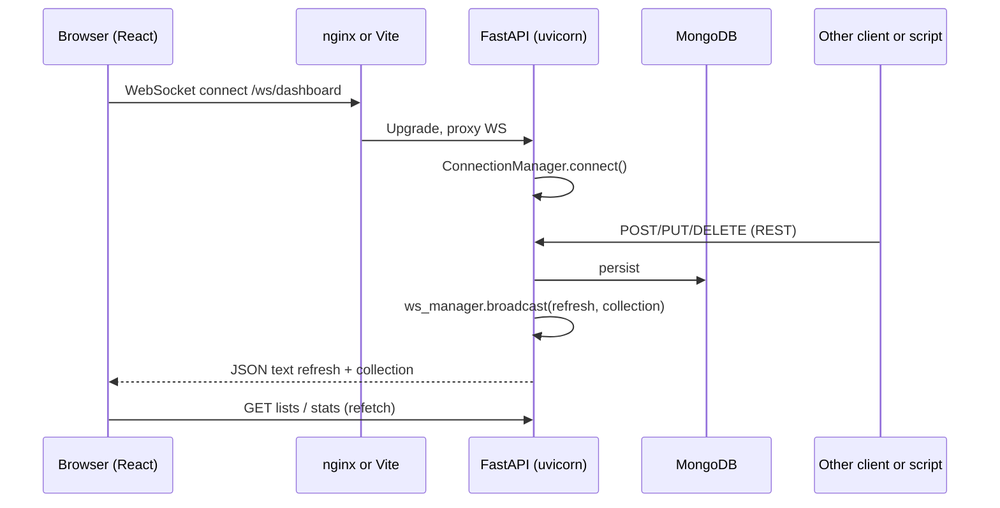

# Real-time UI updates — WebSocket (`/ws/dashboard`)

This document describes how **Doc Hub** pushes “data changed” notifications from the **FastAPI** backend to the **Doc Portal** React UI, what can go wrong, how to **debug** it, and how you might **extend** it. It is written for maintainers and operators.

---

## 1. Purpose (what problem this solves)

- Users may keep **Dashboard** or **list** pages open while another tab, user, or script **creates / updates / deletes** resumes, record collections, or API keys.
- Instead of requiring a manual refresh, the API sends a lightweight **WebSocket message** after successful writes. Subscribed pages **refetch** from the REST API so the UI converges with MongoDB.

**What this is not:** it does not stream full documents over the socket. The socket only signals **“something changed”**; the browser still uses normal **`fetch`** calls to load data.

---

## 2. End-to-end flow (high level)



---

## 3. Message contract

### 3.1 Wire format

- **Transport:** WebSocket text frames.
- **Encoding:** UTF-8 JSON, one object per message (as produced by `json.dumps` on the server).

### 3.2 Payload shape

The server builds messages in [`src/websocket_manager.py`](../src/websocket_manager.py):

```python
message = json.dumps({"event": event, **(payload or {})})
```

With default usage, `event` is `"refresh"` and `payload` contains **`collection`**:

```json
{
  "event": "refresh",
  "collection": "resumes"
}
```

### 3.3 `collection` values (authoritative list)

These strings are what the UI receives today. They match router **tags** / fixed strings in code:

| `collection` value   | Typical source |
|----------------------|----------------|
| `resumes`            | Resume CRUD ([`crud_endpoints.py`](../src/routes/crud_endpoints.py)) |
| `ubuntu_releases`    | Ubuntu record CRUD ([`records_endpoints.py`](../src/routes/records_endpoints.py)) |
| `python_releases`    | Python record CRUD |
| `roman_leaders`      | Roman record CRUD |
| `api_keys`           | Generate / revoke key ([`auth_endpoints.py`](../src/auth/auth_endpoints.py)) |

The React hook **does not** switch on `collection` for most pages: it calls the same **`load()`** regardless. **Dashboard** uses `collection` only for a short **“last updated”** highlight (see [`Dashboard.tsx`](../ui/src/pages/Dashboard.tsx)).

### 3.4 Client → server traffic

The handler runs a receive loop: [`server.py`](../src/server.py) `await websocket.receive_text()`. The frontend sends periodic **`"{}"`** pings (see below) so idle connections keep flowing through proxies. Those strings are **not** interpreted as commands today.

---

## 4. Backend — step by step

### 4.1 Connection lifecycle

1. Client opens **`WS /ws/dashboard`** (often via **`wss://`** or **`ws://`** through a proxy).
2. FastAPI accepts the socket and appends it to **`ConnectionManager.active_connections`** ([`websocket_manager.py`](../src/websocket_manager.py)).
3. While connected, the server awaits **`receive_text()`** until disconnect.
4. On **`WebSocketDisconnect`**, the socket is removed from **`active_connections`**.

### 4.2 When `broadcast` runs

After a successful write that should refresh UIs, code awaits:

```python
await ws_manager.broadcast("refresh", {"collection": "<name>"})
```

**Resume routes** — multiple operations → `collection: "resumes"` ([`crud_endpoints.py`](../src/routes/crud_endpoints.py)).

**Record routes** (Ubuntu / Python / Roman) — create, update, delete → `collection` equals the router **tag** (`ubuntu_releases`, `python_releases`, `roman_leaders`).

**Auth** — generate API key, revoke → `collection: "api_keys"`.

### 4.3 When `broadcast` does **not** run

| Scenario | Result |
|----------|--------|
| Data changed **outside** the API (mongosh, Compass, `mongo-express` SQL-style edits, restore from backup) | No WebSocket message; UIs stay stale until refetch. |
| Request **failed** before DB write (4xx/5xx) | Usually no broadcast (depends on code path). |
| **User registration** / login | No broadcast (not wired). |
| **Delete user** | No broadcast today (could add if Dashboard should react instantly). |

### 4.4 Delivery semantics

- **In-process only:** `ConnectionManager` keeps Python objects in **memory** in a **single process**.
- **Current production command:** `uvicorn server:app` (one worker) in [`build/sh_scripts/app_run.sh`](../build/sh_scripts/app_run.sh) — broadcasts reach **all tabs connected to that process**.
- **If you add Gunicorn + multiple Uvicorn workers:** each worker has its **own** `ConnectionManager`. Clients on worker A will **not** receive broadcasts triggered on worker B unless you add a **shared pub/sub** (Redis, NATS, etc.). This is the **#1 scaling footgun**.

### 4.5 Errors during `send`

If `send_text` raises, the connection is removed from the active list and a warning is logged. Other clients are unaffected.

### 4.6 Authentication

The **`/ws/dashboard`** route does **not** validate JWT or API keys today. Anyone who can reach the URL can **subscribe** to refresh notifications. Payloads are **not** secret (only collection names). For **sensitive** deployments, consider:

- Requiring a **query token** or **subprotocol** header (limited browser support), or
- Terminating WebSocket behind an **authenticated edge** (e.g. OAuth proxy), or
- Moving to **SSE** with cookie session auth.

---

## 5. Frontend — step by step

### 5.1 WebSocket URL construction

Implemented in [`ui/src/hooks/useDashboardWebSocket.ts`](../ui/src/hooks/useDashboardWebSocket.ts).

| Condition | WebSocket URL |
|-------------|----------------|
| **`VITE_API_URL` empty** (typical Doc Portal behind nginx on `:3000`) | `ws(s)://<window.location.host>/ws/dashboard` — same origin as the SPA; **nginx** proxies `/ws/` to the API. |
| **`VITE_API_URL` set** (e.g. `http://localhost:8000`) | `ws(s)://<host from VITE>/ws/dashboard` — must be a host the **browser** can resolve and reach. |

**Critical:** Do **not** bake **`http://doc-hub-api:8000`** into the browser bundle as `VITE_API_URL`. **`doc-hub-api`** is a **Docker network DNS name**; the user’s browser **cannot** resolve it. REST may appear “fine” if you use relative URLs, but WebSocket URL building would break when `VITE_API_URL` points there.

### 5.2 Hook behavior (`useDashboardWebSocket`)

1. On mount, opens **one** WebSocket (the inner `connect` callback is memoized with **`[]`** — connection is not recreated on every render).
2. **`onRefresh`** is stored in a **ref** updated every render so the latest **`load`** function is always called.
3. On each message: **`JSON.parse` → if `event === 'refresh'` → `onRefreshRef.current(data.collection)`**.
4. **Keepalive:** every **25s**, sends **`"{}"`** while open (reduces idle disconnects through **30s** proxy timeouts).
5. **On close:** schedules **`connect` again after 3000 ms** (simple reconnect backoff).
6. **On error:** closes the socket (triggers reconnect path).
7. On unmount, closes the WebSocket.

**There is no intentional debounce** on refresh: refetch starts as soon as the message arrives.

### 5.3 Which pages subscribe

These components call **`useDashboardWebSocket(...)`**:

| Page | File |
|------|------|
| Dashboard | [`ui/src/pages/Dashboard.tsx`](../ui/src/pages/Dashboard.tsx) |
| Resume list | [`ui/src/pages/ResumeList.tsx`](../ui/src/pages/ResumeList.tsx) |
| Ubuntu list | [`ui/src/pages/UbuntuReleaseList.tsx`](../ui/src/pages/UbuntuReleaseList.tsx) |
| Python list | [`ui/src/pages/PythonReleaseList.tsx`](../ui/src/pages/PythonReleaseList.tsx) |
| Roman list | [`ui/src/pages/RomanLeaderList.tsx`](../ui/src/pages/RomanLeaderList.tsx) |

**Not subscribed** (examples): detail pages, login/register, standalone API Keys page — unless you add the hook there.

**Note:** Each mounted page opens **its own** WebSocket connection. Five tabs on five list routes ⇒ five connections (acceptable at small scale; see enhancements).

### 5.4 What happens on `refresh`

Typically **`load()`** runs:

- **List pages:** refetch **current page** of data (`skip` / `limit` / search from React state).
- **Dashboard:** refetches **multiple** lists and stats in parallel.

So the UI updates **after** the follow-up HTTP requests complete (network + server latency), not at the exact millisecond of the WebSocket frame.

---

## 6. Proxies (nginx & Vite)

### 6.1 Production UI (`doc-hub-ui`, nginx)

[`build/nginx-ui.conf`](../build/nginx-ui.conf):

```nginx
location /ws/ {
    proxy_pass http://doc-hub-api:8000;
    proxy_http_version 1.1;
    proxy_set_header Upgrade $http_upgrade;
    proxy_set_header Connection "upgrade";
    ...
}
```

**Requirements:** `Upgrade` and `Connection: upgrade` are required for WebSockets. If you terminate TLS elsewhere, ensure the upgrade headers are forwarded.

**Optional hardening:** set **`proxy_read_timeout`** (and **`proxy_send_timeout`**) higher than idle periods if corporate proxies drop long-lived connections (e.g. **3600s**).

### 6.2 Vite dev server

[`ui/vite.config.ts`](../ui/vite.config.ts) proxies **`/ws`** to `http://localhost:8000` with **`ws: true`**.

---

## 7. HTTP caching (and why lists use `no-store`)

- [`recordsApi.ts`](../ui/src/api/recordsApi.ts) list fetch uses **`fetch(..., { cache: 'no-store' })`**.
- [`resumeApi.ts`](../ui/src/api/resumeApi.ts) list fetch uses **`cache: 'no-store'`** for the list endpoint.

That reduces the chance of the **browser HTTP cache** serving **stale** JSON after a WebSocket-driven refetch.

**Gap:** [`dashboardApi.ts`](../ui/src/api/dashboardApi.ts) and [`apiKeysApi.ts`](../ui/src/api/apiKeysApi.ts) do **not** pass **`cache: 'no-store'`** today. For consistency, add it to those `fetch` calls if you ever see stale stats/keys after refresh.

**There is no application-level cache** (React Query / SWR) in this repo; each `load()` hits the network.

---

## 8. Debugging checklist

### 8.1 Browser (fastest)

1. Open **DevTools → Network → WS** (or Filter “WS”).
2. Load Dashboard or a list page — you should see **`/ws/dashboard`** with status **101 Switching Protocols**.
3. Trigger a change (e.g. delete a roman leader via API).
4. Confirm an **incoming** frame with JSON `{"event":"refresh",...}`.
5. If **no 101**: wrong URL, proxy blocking upgrade, or mixed content (`https` page + `ws:`).

### 8.2 Compare REST vs WS host

- If **`fetch`** goes to **`http://localhost:8000`** but **WebSocket** goes to **`ws://localhost:3000`**, both can work **if** nginx proxies `/ws/`. If one works and the other does not, compare **`VITE_API_URL`** and **`getWebSocketUrl()`** output (temporary `console.log` in dev).

### 8.3 Server logs

- On connect/disconnect, **`ConnectionManager`** logs connection counts (INFO). Ensure logging level shows INFO in your environment.

### 8.4 Simulate without UI

```bash
# Example: use websocat or wscat to connect and print frames
# brew install websocat   OR   npx wscat -c ws://127.0.0.1:8000/ws/dashboard
```

Then trigger a write; you should see one JSON line per broadcast.

### 8.5 “Data changed but UI flat”

| Check | Action |
|-------|--------|
| Change bypassed API? | Use API or script that calls REST. |
| Wrong page open? | Subscribe only on listed routes. |
| Stale Docker UI image? | Rebuild `doc-hub-ui` if frontend changed. |
| `VITE_API_URL` wrong in built assets? | Rebuild UI with correct env or leave unset for same-origin. |

---

## 9. Possible improvements (short roadmap)

### 9.1 Backend

| Idea | Benefit |
|------|---------|
| **Redis pub/sub** (or similar) between workers | Safe **multi-worker** deployments; one channel `doc_hub:refresh`. |
| **Structured payload** | e.g. `{ "op": "delete", "id": "...", "collection": "roman_leaders" }` so clients could patch local state without full refetch. |
| **Broadcast on user delete** | Dashboard user counts / lists stay accurate. |
| **Rate-limit broadcasts** | Coalesce many writes into one notification per 100ms (reduce thundering herd). |
| **Auth on WebSocket** | Query param JWT or first-message auth; drop unauthenticated clients. |

### 9.2 Frontend

| Idea | Benefit |
|------|---------|
| **Single shared WebSocket** (context provider) | One connection per browser tab instead of one per page component. |
| **Refetch only if `collection` matches** | Roman list ignores `ubuntu_releases` refreshes — less load. |
| **React Query / SWR** | Deduped fetches, background refresh, stale-while-revalidate. |
| **`cache: 'no-store'`** on dashboard + api-keys fetches | Align with list endpoints. |
| **Exponential backoff** on reconnect | Replace fixed 3s with capped exponential + jitter. |
| **Visible “live” indicator** | Show WS connected / reconnecting for supportability. |

### 9.3 Operations

| Idea | Benefit |
|------|---------|
| **Nginx timeouts** | Fewer silent drops on idle WS. |
| **Metrics** | Count connections, broadcasts/sec, failed sends. |

---

## 10. Related files (quick index)

| Layer | Path |
|-------|------|
| Manager | [`src/websocket_manager.py`](../src/websocket_manager.py) |
| WS route | [`src/server.py`](../src/server.py) (`/ws/dashboard`) |
| Broadcast call sites | [`src/routes/crud_endpoints.py`](../src/routes/crud_endpoints.py), [`src/routes/records_endpoints.py`](../src/routes/records_endpoints.py), [`src/auth/auth_endpoints.py`](../src/auth/auth_endpoints.py) |
| React hook | [`ui/src/hooks/useDashboardWebSocket.ts`](../ui/src/hooks/useDashboardWebSocket.ts) |
| nginx | [`build/nginx-ui.conf`](../build/nginx-ui.conf) |
| Vite | [`ui/vite.config.ts`](../ui/vite.config.ts) |
| API overview | [`docs/endpoints_README.md`](endpoints_README.md) (WebSocket section) |

---

## 11. Summary

- **Backend:** after successful writes, **`broadcast`** sends **`{"event":"refresh","collection":...}`** to all sockets in **that process**.
- **Frontend:** subscribed pages **immediately** schedule a **REST refetch**; there is **no fixed delay** except **3s reconnect** after a dropped connection.
- **Caching:** list **`fetch`** uses **`no-store`**; dashboard/API-key fetches could be aligned.
- **Scaling:** multiple API workers need a **shared bus** for WebSocket fan-out.
- **Debug:** verify **101** on **`/ws/dashboard`** and incoming frames when mutating data via the **API**.

For setup and URLs, see [`dev_setup_readme.md`](dev_setup_readme.md) and [`architecture.md`](architecture.md).
